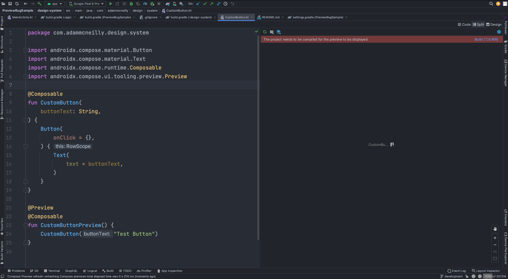

# Preview Bug Sample

* Open the app in Android Studio (used Bumblebee 2021.1.1).
* Open the `CustomButton` file in the design-system module.
* You will see the preview window on the right, but we are unable to render anything unless we 
  add the activity dependency.
* That dependency is in the design-system/build.gradle file you can uncomment it to verify.

Here is what I see:

